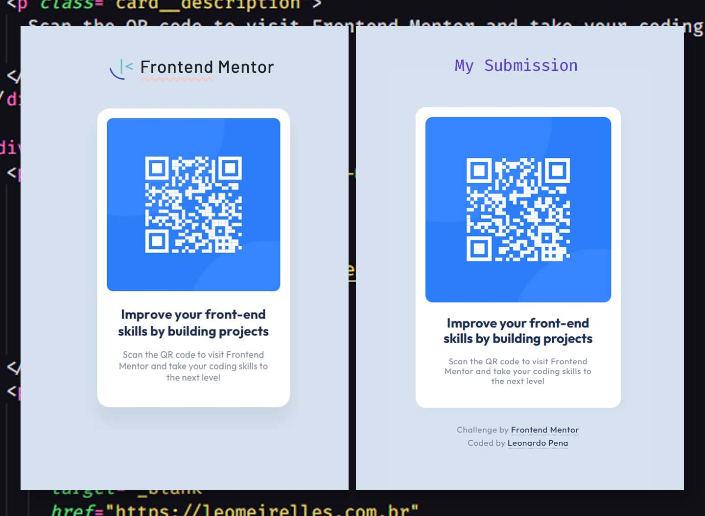

# Frontend Mentor - QR code component solution

This is a solution to the [QR code component challenge on Frontend Mentor](https://www.frontendmentor.io/challenges/qr-code-component-iux_sIO_H). Frontend Mentor challenges help you improve your coding skills by building realistic projects.

## Table of contents

- [Overview](#overview)
  - [Screenshot](#screenshot)
  - [Links](#links)
- [My process](#my-process)
  - [Built with](#built-with)
  - [What I learned](#what-i-learned)
  - [Continued development](#continued-development)
  - [Useful resources](#useful-resources)
- [Author](#author)

## Overview

### Screenshot



### Links

<!-- ! change solution url -->

- Solution URL: [Frontend Mentor](https://www.frontendmentor.io/solutions/qr-code-component-solution-using-flexbox-lt1XQUKVyR)
- Live Site URL: [https://leomcpena.github.io/qr-code-frontend-mentor/](https://leomcpena.github.io/qr-code-frontend-mentor/)

## My process

### Built with

- HTML5
- CSS custom properties
- Flexbox

### What I learned

I selected this challenge because it is simple, so i would have time to focus on learning more about how to use Git, GitHub and how to submit a solution to a challenge on Frontend Mentor.

About the design, I was aiming a pixel perfect reproduction using good practicies like creating variables and naming classes following a system.

When i was trying to make the border-radius of the image matches the mockup, i realized that the values of the card border-radius and the image border-radius were not the same. So, I used a calc() inside CSS to make sure that, if I want to change the border-radius of the card later, the border-radius of the image would follow the proportion.

You can see my solution below:

```css
:root {
  --border-radius: 1.2rem;
}
.card {
  border-radius: var(--border-radius);
}
.card__img {
  border-radius: calc(var(--border-radius) * 0.7);
}
```

Futhermore, I used my experience as a graphic designer to set line-height and letter-spacing so the final result would be just like the mockup image.

### Continued development

Now that I am a little bit more comfortable with Git, GitHub and so on, i want to continue challenging myself with more advanced layouts. I want to dive into responsive web design and accessibility.

### Useful resources

- [Free Course: Conquering Responsive Layouts - by Kevin Powell](https://courses.kevinpowell.co/view/courses/conquering-responsive-layouts) - This helped me to build confidence in tackling challenges like these. It made me plan ahead and think about the layout in HTML and CSS terms.

## Author

- Website - [Leonardo Pena](https://www.leomeirelles.com.br/)
- Frontend Mentor - [@leomcpena](https://www.frontendmentor.io/profile/leomcpena)
